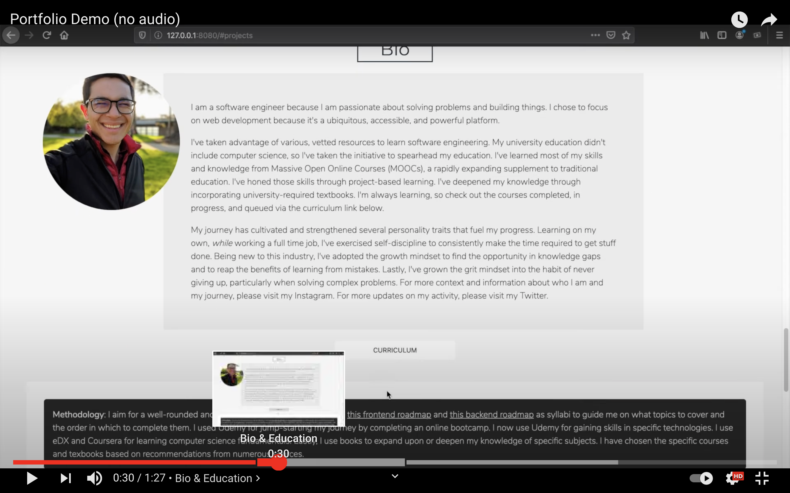

<div align="center">
  

# [Professional Portfolio](https://www.jacobgrisham.com/)

[](https://app.netlify.com/sites/jacobgrisham/deploys)

[](https://codeclimate.com/github/JacobGrisham/Professional-Portfolio/maintainability)
[](https://www.codacy.com/gh/JacobGrisham/Professional-Portfolio/dashboard?utm_source=github.com&amp;utm_medium=referral&amp;utm_content=JacobGrisham/Professional-Portfolio&amp;utm_campaign=Badge_Grade)
 
</div>
  
## 🎥 Walkthrough on Youtube
[](https://youtu.be/hcrmmneYZkc)

## 💡Lessons Learned
-   Performance, Security, Accessibility, and SEO optimization with [Lighthouse](https://developers.google.com/web/tools/lighthouse). Increased Google Lighthouse performance score from 12 to 88 .
-   Decreased **average** DOM Content Loaded time from 10s  to 2s using intersection observer and lazy loading for images and video. Further decreased **first visit** DOM Content Loaded time from 7s to 1s 	by refactoring website from using an express.js server to a static site with no web server.
-   Increased SEO to achieve Google PageRank #1 for the search term “jacob grisham”. Used Open Graph Meta Properties (og:image, etc.) to help increase ranking.
-   User Experience optimization with loading page and SVG animation, parallax scrolling, fade-in images
-   Optimized responsive design for 8 screen sizes (desktop, tablet, and mobile) using Sass to implement floats, flexbox, grid, and media queries
-   Increased cross-browser compatibility using LambdaTest
-   First time using Google Analytics and first time routing website to a domain name

## 🛠 Technologies
|Graphic Design|Front-End|Deployment |Testing |
|------------- | ------- | --------  | -------|
|Inkscape	     |HTML5	   |Netflify   |[LambdaTest](https://www.lambdatest.com/)    |
|.			       |CSS3		 |Git        |[Lighthouse](https://developers.google.com/web/tools/lighthouse) |
|.			       |Sass     |.          |.       |
|.			       |Javascript|.		     |.		    |.|
|.             |jQuery   |.          |.       |.|

## ⚖️ Methodology
-   Initially built this website with a backend server using [ExpressJS](https://expressjs.com/) as the Node.js application framework, which was primarily used for serving the single page and for setting HTTP headers and Content Security Policy. The website was hosted on the Hobby (paid) plan on Heroku. The main problem with this approach was that it was both heavy and expensive. It was heavy in that ExpressJS wasn't strictly neccessary just to serve a single page. It was expensive in that the Hobby plan was $7 per month. Therefore, after learning about the [Jamstack](https://jamstack.org/), refactored this application by migrating from a server-based architecture with ExpressJS to a static website architecture with simple HTML. I switched cloud-hosting providers from Heroku to Netlify. The code is more simple and efficient, the website has better performance, and the cloud-hosting provider is free.
-   (Deprecated) [ExpressJS](https://expressjs.com/) as the Node.js application framework for its basic functionality. Some companies still use ExpressJS so it was important to implement it.
-   (Deprecated) [Heroku](https://www.heroku.com/) due to the simplicity of the website

## 🚀 Getting Started
To run this project locally, install dependencies using npm
```
$ npm install
```
Run node-sass in watch mode for hot reloading
```
$ npm run dev
```
Run node-sass in production mode before pushing to production
```
$ npm run build
```

## 📐 Tests
-   LambdaTest cross browser testing

## 🔒 License
Copyright Notice and Statement: currently not offering any license. Permission only to view and download.
